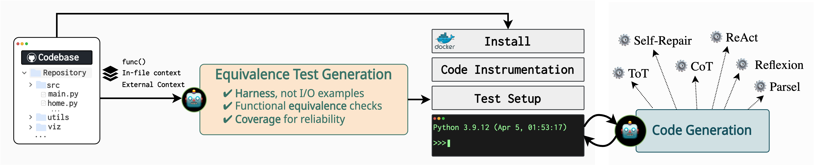

<p align="center">
  <a href="https://www.r2e.dev">
    
  </a>
</p>


<p align="center">
  <a href="https://r2e.dev"><strong>🌐 Website & Demos</strong></a>&nbsp; | &nbsp;
  <a href="https://r2e.dev/pdfs/paper.pdf"><strong>📄 Paper @ ICML 2024</strong></a>&nbsp; | &nbsp;
  <a href=""><strong>🤗 Datasets (coming soon!)</strong></a>&nbsp;
</p>

---


## Overview

This is the code for the [R2E framework](https://r2e.dev). 
Building a scalable and interactive testbed for evaluating general-purpose AI programming agents
for real-world code has been challenging, particularly due to a lack of high-quality test suites
available.

R2E turns *any* GitHub repository into an executable environment for evaluating static code generation models and programming agents at scale. 
It extracts functions and methods from the repository, generates **equivalence tests** for them, and executes these tests in a Docker container. 
The generated tests and corresponding environments are used to evaluate the quality of the code generated by the programming agents.



## Installation

You can clone the repository using the following command. We recommend `poetry` for managing dependencies. You can also use a standard `pip install -e .` to install the package.
```bash
git clone https://github.com/r2e-project/r2e.git
cd r2e
pip install poetry
poetry install
```

## Converting Repositories to Environments

You can use R2E to convert GitHub repositories into environments for programming agents. First, R2E builds and installs the repository in a Docker image. Then, we extract the functions and methods from the repository and generate
**Equivalence Tests** for them.

These tests are then executed in the Docker container using R2E's custom testing framework [R2E Test Server](https://github.com/r2e-project/r2e-test-server). This server provides an interface for agents to interact with the built environment and execute arbitrary code. Here are these steps in more detail:

> [!Tip]
>
> Configure your paths in the [config.yml](./r2e/config.yml) file. These paths will define where your repositories are located and generated data is stored.


### 1. Setup and Extract Functions

#### 1.1 Clone and Setup Repositories
Relevant Code: [SetupRepos](./r2e/repo_builder/setup_repos.py)

R2E first clones and sets up repositories locally. It supports cloning from a URL, copying from a local path, or processing a list of URLs or local paths.
```bash
python r2e/repo_builder/setup_repos.py 
    --repo_url <repo_url> 
    --local_repo_path <local_repo_path> 
    --repo_urls_file <repo_urls_file> 
    --cloning_multiprocess <cloning_multiprocess>
```

Replace:
- <repo_url> with the URL of the repository you want to clone.
- <local_repo_path> with the local path of the repository you want to copy.
- <repo_urls_file> with the path to a JSON file containing a list of repository URLs or local paths.
- <cloning_multiprocess> with the number of processes you want to use for cloning or copying.

> [!Note]
>
> You only need to provide one of repo_url, local_repo_path, or repo_paths_urls_file. After cloning or copying the repositories, the script will run [PyCG](https://arxiv.org/abs/2103.00587) to generate callgraphs for the repositories.

#### 1.2 Extract Functions and Methods
Relevant Code: [extract_func_methods.py](./r2e/repo_builder/extract_func_methods.py)

With the repos and callgraphs in place, we can now extract the functions and methods:

```bash
python r2e/repo_builder/build_func_methods.py 
    --exp_id <experiment_id> 
    --overwrite_extracted <overwrite_flag> 
    --extraction_multiprocess <num_processes>
```

Replace:
- <experiment_id> with your experiment ID.
- <overwrite_flag> with True if you want to overwrite the existing extracted data, False otherwise.
- <num_processes> with the number of processes you want to use for extraction.

> [!Note]
>
> The script will find all directories in the REPOS_DIR directory (where your repos were cloned), and extract functions and methods from them. The extracted functions and methods are written to a JSON file in the EXTRACTION_DIR directory. If the extraction file already exists, the script will not overwrite it unless you set --overwrite_extracted to True.


### 2. Build Repositories

#### 2.1 Generate Dockerfile 
Relevant Code: [r2e_dockerfile_builder.py](./r2e/repo_builder/docker_builder/r2e_dockerfile_builder.py)

R2E builds and installs the repositories in a Docker image. This image is used to execute the generated tests in the next step. We first generate a dockerfile and then build the image.

```bash
python r2e/repo_builder/docker_builder/build_func_methods.py 
  --install_batch_size <install_batch_size>
```

Replace:
- <install_batch_size> with the batch size for installing the repositories in parallel in the Docker image.

> [!Note]
>
> The dockerfile will copy all the directories in the REPOS_DIR directory (where your repos were cloned) to the Docker image. It will then install the repositories using a combination of [`pdm`](pdm-project.org) and `pip` install commands. The Docker image is stored in the [docker_builder](./r2e/repo_builder/docker_builder) directory.

#### 2.2 Build Docker Image
Once the dockerfile is generated, we can build the Docker image using the following command:

```bash
docker build -t r2e:<experiment_id> -f <dockerfile_path> .
```

Replace:
- <experiment_id> with your experiment ID for the docker name.
- <dockerfile_path> with the path to the generated dockerfile [docker_builder](./r2e/repo_builder/docker_builder)

> [!Note]
>
> Since we COPY all the directories in the REPOS_DIR directory to the Docker image, the docker build command needs to be run from REPOS_DIR. You can change this behavior by modifying Line 27 of the generated docker file. 

> [!Tip]
>
> Please follow [http://docs.docker.com/engine/install/](http://docs.docker.com/engine/install/) for instructions on installing docker. It is recommended to follow the post-installation steps to run docker as a non-root user. 

### 3. Generate Equivalence Test Harnesses

#### 3.1 Generation

Relevant Code: [R2ETestGenerator](./r2e/generators/testgen/generate.py)

```bash
python r2e/generators/testgen/generate.py 
    -i <input_json> 
    --exp_id <experiment_id>  
    --multiprocess <num_processes>
    --cache_batch_size <batch_size_for_caching_llm_calls>
```
> [!Note]
>
> This generates the **equivalence tests** for the functions/methods in the input JSON file. R2E generates the tests using a combination of static analysis and prompting language models. Several other args are available to control the generation process and language model in [testgen/args.py](./r2e/generators/testgen/args.py).


#### 3.2 Execution 

Relevant Code: [run_self_equiv.py](./r2e/execution/run_self_equiv.py)

```bash
python r2e/execution/run_self_equiv.py 
    --testgen_exp_id <testgen_experiment_id> 
    --execution_multiprocess <num_processes>
    --timeout_per_task <execution_timeout>
```

Replace:
- <testgen_experiment_id> with the experiment ID (file name) of the test generation (e.g., for `r2e_generate.json`, use `r2e_generate`).
- <num_processes> with the number of processes you want to use for execution.
- <execution_timeout> with the timeout for each test execution.

> [!Note]
>
> The script will execute the generated tests in the Docker container. The results are stored in the [EXECUTION_DIR] directory. 


#### 3.3 Evaluation

Relevant Code: [TestGenEvaluator](./r2e/evaluators/testgen.py)

```bash
python r2e/evaluators/testgen.py <path_to_execution_output_file>
```

> [!Note]
> This would give you a summary of the generated tests and their execution results. The evaluator also provides a detailed breakdown of the execution results for each test.

#### 3.4 Filtering and Oversampling Tests

Relevant Code: [R2ETestGenerator.filter](./r2e/generators/testgen/generate.py) | [R2ETestOversample](./r2e/generators/testgen/oversample.py)

One can easily <u>filter</u> out invalid tests after execution, by updating \_\_main\_\_ in [generate.py](./r2e/generators/testgen/generate.py):
```diff
if __name__ == "__main__":
    args = fire.Fire(TestGenArgs)

-    R2ETestGenerator.generate(args)
+    R2ETestGenerator.filter(args)
```

> [!Note]
> Invalid tests are those that did not pass on execution in the previous step. Tests can fail either due to environmental reasons or
> syntax/semantic issues in the generated test itself.

Furthermore, one can also <u>oversample</u> additional tests, given some passing ones (say to improve coverage for a function):
```bash
python r2e/generators/testgen/oversample.py 
    -i <input_json> 
    --exp_id <experiment_id>  
    --multiprocess <num_processes>
    --cache_batch_size <batch_size_for_caching_llm_calls>
```

## Building benchmarks with R2E

Relevant Code: [SpecGenerator](./r2e/generators/specgen/generate.py)

While the user is free to choose the extracted functions to benchmark code LLMs and programming agents, we provide some tools and strategies to build robust benchmarks based on our study.

**Improving Specifications:** We believe that natural language docstrings in GitHub repos might
be ambiguous or under-specified for use in code generation. We provide an automated approach to refine these docstrings using language models by providing them useful information on the observed behavior of the function when executed using the generated test harness
```bash
python r2e/generators/specgen/generate.py
    -i <input_json> 
    --exp_id <experiment_id>  
    --multiprocess <num_processes>
    --cache_batch_size <batch_size_for_caching_llm_calls>
```

> [!Note]
>
> The input file must be functions that _have been executed_ using tests from the previous section. The results of execution, such as I/O examples, type signatures, etc., are provided to the LLM for refinement. More details on this in our [paper](r2e.dev/pdfs/r2e_paper.pdf).

## Other Details

#### PAT: Program Analysis Tools 
R2E is powered by a synergistic combination of program analysis and LLMs. We implemented a new toolbox of analysis tools for Python, which we call [⚒ PAT](./r2e/pat). For more details on what these tools enable and how they are used, please refer to the [PAT documentation](./r2e/pat/README.md).

---

For more details on the R2E project, refer to [r2e.dev](https://r2e.dev)!

## Citation

If you use R2E in your research, please cite the following paper:

```bibtex
@inproceedings{
    jain2024r2e,
    title={R2E: Turning any Github Repository into a Programming Agent Environment},
    author={Naman Jain and Manish Shetty and Tianjun Zhang and King Han and Koushik Sen and Ion Stoica},
    booktitle={ICML},
    year={2024},
}
```
