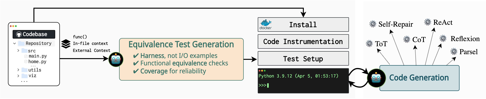

<p align="center">
  <a href="https://www.r2e.dev">
    
  </a>
</p>


<p align="center">
  <a href="https://r2e.dev"><strong>🌐 Website & Demos</strong></a>&nbsp; | &nbsp;
  <a href="https://r2e.dev/pdfs/paper.pdf"><strong>📄 Paper @ ICML 2024</strong></a>&nbsp; | &nbsp;
  <a href=""><strong>🤗 Datasets (coming soon!)</strong></a>&nbsp;
</p>

---


## Overview

This is the code for the [R2E framework](https://r2e.dev). 
Building a scalable and interactive testbed for evaluating general-purpose AI programming agents
for real-world code has been challenging, particularly due to a lack of high-quality test suites
available.

R2E turns *any* GitHub repository into an executable environment for evaluating static code generation models and programming agents at scale. 
It extracts functions and methods from the repository, generates **equivalence tests** for them, and executes these tests in a Docker container. 
The generated tests and corresponding environments are used to evaluate the quality of the code generated by the programming agents.



## Installation

1. Install `uv` if you don't have it. This is our recommended way to install the package dependencies.
```bash
curl -LsSf https://astral.sh/uv/install.sh | sh
```

2. Create a virtual environment, clone the repo, and install it.
```bash
git clone https://github.com/r2e-project/r2e.git
cd r2e
uv venv
source .venv/bin/activate
uv sync
```

## Converting Repositories to Environments

You can use R2E to convert GitHub repositories into environments for programming agents. First, R2E builds and installs the repository in a Docker image. Then, we extract the functions and methods from the repository and generate
**Equivalence Tests** for them.

These tests are then executed in the Docker container using R2E's custom testing framework [R2E Test Server](https://github.com/r2e-project/r2e-test-server). This server provides an interface for agents to interact with the built environment and execute arbitrary code. Here are these steps in more detail:

> [!Tip]
> Configure your paths in the [config.yml](./r2e/config.yml) file. These paths will define where your repositories are located and generated data is stored.


### 1. Setup and Extract Functions

#### 1.1 Clone and Setup Repositories

Use the following command to clone and setup repositories. It supports cloning from a URL, copying from a local path, or processing a list of URLs or local paths.
```bash
r2e setup 
    --repo_url <repo_url> 
    --local_repo_path <local_repo_path> 
    --repo_urls_file <repo_urls_file> 
    --cloning_multiprocess <cloning_multiprocess>
```

Replace:
- <repo_url> with the URL of the repository you want to clone.
- <local_repo_path> with the local path of the repository you want to copy.
- <repo_urls_file> with the path to a JSON file containing a list of repository URLs or local paths.
- <cloning_multiprocess> with the number of processes you want to use for cloning or copying.

> [!Note]
> You only need to provide one of repo_url, local_repo_path, or repo_paths_urls_file. After cloning or copying the repositories, the script will run [PyCG](https://arxiv.org/abs/2103.00587) to generate callgraphs if `--run_pycg` is specified.

#### 1.2 Extract Functions and Methods
To extract functions and methods, use the following command:

```bash
r2e extract
    --exp_id <experiment_id> 
    --extraction_multiprocess <num_processes>
    --overwrite_extracted
```

Replace <experiment_id> with your experiment ID and <num_processes> with the number of processes you want to use for extraction.

> [!Note]
> The script will find all directories in the REPOS_DIR directory (where your repos were cloned), and extract functions and methods from them. The extracted functions and methods are written to a JSON file in the EXTRACTION_DIR directory. If the extraction file already exists, the script will not overwrite it unless you set --overwrite_extracted to True.


### 2. Build Repositories (in Docker)

R2E builds and installs the repositories in a Docker image. This image is used to execute the generated tests in the next step.
```bash
r2e build --exp_id <experiment_id> --install_batch_size <install_batch_size>
```

Replace <experiment_id> with your experiment ID and <install_batch_size> with the batch size for installing the repositories in parallel in the Docker image.

> [!Note]
> The dockerfile will copy all the directories in the REPOS_DIR directory (where your repos were cloned) to the Docker image. It will then install the repositories using a combination of [`pdm`](pdm-project.org) and `pip` install commands. The Docker image is stored in the [docker_builder](./r2e/repo_builder/docker_builder) directory.

> [!Tip]
> Please follow [http://docs.docker.com/engine/install/](http://docs.docker.com/engine/install/) for instructions on installing docker. It is recommended to follow the post-installation steps to run docker as a non-root user. 

### 3. Generate Equivalence Test Harnesses

#### 3.1 Generation
```bash
r2e generate --exp_id <experiment_id>
```

> [!Note]
> This generates the **equivalence tests** for the functions/methods in the input JSON file. R2E generates the tests using a combination of static analysis and prompting language models. Several other args are available to control the generation process and language model in [testgen/args.py](./r2e/generators/testgen/args.py).

#### 3.2 Execution
```bash
r2e execute --exp_id <experiment_id> 
```

> [!Note]
> The script will execute the generated tests in the Docker container. The results are stored in the [EXECUTION_DIR] directory. 


#### 3.3 Evaluation
```bash
r2e show --exp_id <experiment_id> --summary
```

> [!Note]
> This would give you a summary of the generated tests and their execution results. The evaluator also provides a detailed breakdown of the execution results for each test.


## Building benchmarks with R2E

Relevant Code: [SpecGenerator](./r2e/generators/specgen/generate.py)

While the user is free to choose the extracted functions to benchmark, we provide some tools and strategies to build robust benchmarks based on our study.

**Improving Specifications:** We believe that natural language docstrings in GitHub repos might
be ambiguous or under-specified for use in code generation. We provide an automated approach to refine these docstrings using language models by providing them useful information on the observed behavior of the function when executed using the generated test harness
```bash
python r2e/generators/specgen/generate.py
    -i <input_json> 
    --exp_id <experiment_id>  
    --multiprocess <num_processes>
    --cache_batch_size <batch_size_for_caching_llm_calls>
```

> [!Note]
> The input file must be functions that _have been executed_ using tests from the previous section. The results of execution, such as I/O examples, type signatures, etc., are provided to the LLM for refinement. More details on this in our [paper](r2e.dev/pdfs/r2e_paper.pdf).


---

For more details on the R2E project, refer to [r2e.dev](https://r2e.dev)!

## Citation

If you use R2E in your research, please cite the following paper:

```bibtex
@inproceedings{
    jain2024r2e,
    title={R2E: Turning any Github Repository into a Programming Agent Environment},
    author={Naman Jain and Manish Shetty and Tianjun Zhang and King Han and Koushik Sen and Ion Stoica},
    booktitle={ICML},
    year={2024},
}
```
